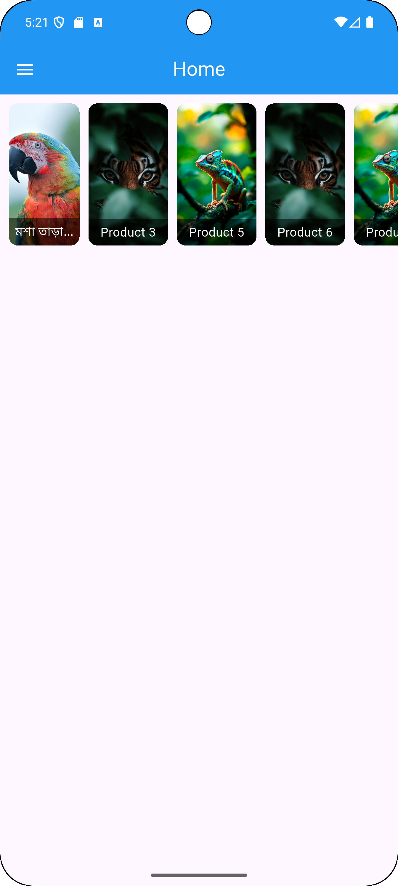

# 📖 Story Page

🚀 A lightweight **Flutter** widget for creating Instagram/Snapchat-like **story sections** in your apps.

---

## ✨ Features
- 📱 **Cross-platform**: Works on Android, iOS, and Web
- 🎨 **Customizable**: Add images, texts, or custom widgets
- 👆 **Gesture support**: Tap right ➡️ next, tap left ⬅️ previous
- ⏱ **Progress indicators** with adjustable duration
- 🔄 Callbacks for `onComplete`, `onStoryChange`, etc.

---


### 📥 Clone the Repository
```bash
git clone https://github.com/prothesbarai/story_page.git
```

## Screenshots
<p float="left">
  
  
  
</p>
